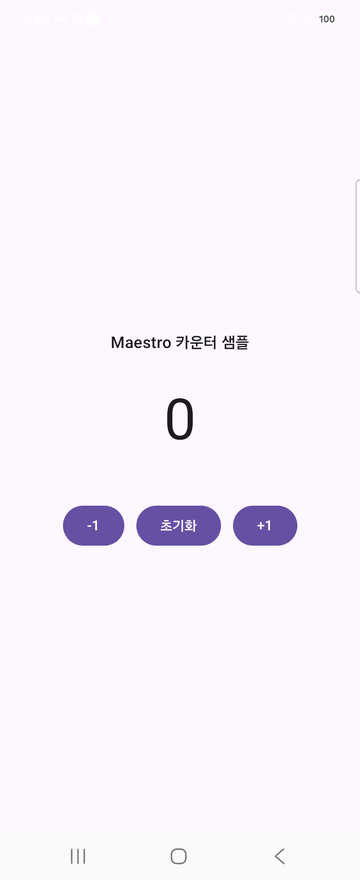
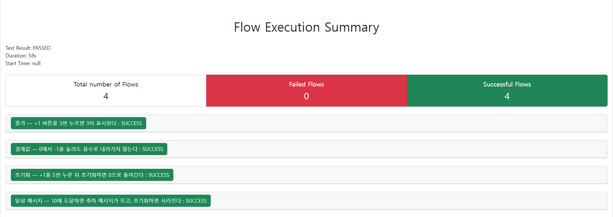

# AI와 Maestro로 안드로이드 앱 자동화 테스트하기 (1) — 스크립트 작성부터 리포트까지 한 번에

안드로이드 앱을 만들다 보면 화면이 하나둘 늘어날 때마다 "이 버튼 눌러보고, 저 화면 들어가보고" 하는 수동 테스트가 점점 지겨워집니다. 매번 빌드하고, 폰에 설치하고, 손으로 눌러보고... 반복되는 이 과정을 자동화할 수는 없을까요?

이번 글에서는 **Maestro**라는 오픈소스 UI 자동화 테스트 도구를 이용해서, AI에게 "이 화면 테스트하는 스크립트 짜줘"라고 부탁하는 것만으로 테스트 작성 → 단말 실행 → 결과 리포트 생성까지 전부 자동화하는 과정을 보여드리겠습니다. 코드 한 줄 몰라도 따라올 수 있도록 최대한 쉽게 설명합니다.

## 1. Maestro가 뭔가요?

Maestro는 YAML 파일 몇 줄로 "화면을 눌러라", "이 글자가 보이는지 확인해라" 같은 시나리오를 적어두면, 실제 안드로이드/iOS 단말에서 그대로 재현해주는 오픈소스 테스트 도구입니다. Appium 같은 기존 도구보다 설정이 훨씬 간단한 게 특징입니다.

```
maestro test 내플로우.yaml
```

이 명령어 하나면 YAML에 적힌 대로 앱이 자동으로 눌리고, 검증되고, 결과가 나옵니다.

## 2. 테스트 대상 샘플 앱

너무 복잡한 앱으로 시작하면 뭐가 뭔지 헷갈리니, 이번 글에서는 아주 단순한 **카운터 앱**을 준비했습니다.

- 가운데 큰 숫자로 현재 카운트를 표시
- `-1` / `초기화` / `+1` 버튼 세 개
- 카운트가 0 밑으로는 내려가지 않음
- **10에 도달하면** "🎉 10 달성!" 이라는 축하 메시지가 나타남


*카운트 0 → +1을 눌러 3 → 10에 도달하면 축하 메시지가 나타나는 모습*

### 화면이 꺼지면 테스트가 실패한다 — 화면 꺼짐 방지 코드

자동화 테스트를 실제 단말에서 돌리다 보면 의외로 자주 겪는 문제가 있습니다. 테스트 도중 화면이 꺼져 절전모드로 들어가면, Maestro가 화면 요소를 하나도 찾지 못해 테스트가 실패해 버립니다. 그래서 `MainActivity`에 화면이 꺼지지 않도록 플래그를 하나 추가해줍니다.

```kotlin
override fun onCreate(savedInstanceState: Bundle?) {
    super.onCreate(savedInstanceState)
    // 앱이 포그라운드에 있는 동안 화면이 꺼지지 않도록 유지
    // (Maestro 테스트 도중 화면이 꺼지면 빈 화면 계층만 보여 테스트가 실패한다).
    window.addFlags(WindowManager.LayoutParams.FLAG_KEEP_SCREEN_ON)
    ...
}
```

딱 한 줄이지만, 실제 단말로 테스트를 자동화할 때는 꼭 챙겨야 하는 부분입니다.

## 3. AI에게 테스트 스크립트를 부탁하기

앱 화면 구성(카운터 텍스트, 버튼 3개, 10 달성 메시지)을 AI에게 설명하고 "이 화면을 검증하는 Maestro 테스트를 짜줘"라고 요청하면, 아래와 같은 YAML 파일들이 만들어집니다. 사람이 한 줄씩 짤 필요 없이, 어떤 시나리오를 검증하고 싶은지만 알려주면 됩니다.

이번 샘플에서는 4가지 시나리오를 만들었습니다.

| 파일 | 검증 내용 |
|---|---|
| `01_increment.yaml` | `+1` 버튼 3회 → `3` 표시 확인 |
| `02_boundary.yaml` | `0`에서 `-1` 눌러도 음수로 안 내려감 (경계값) |
| `03_reset.yaml` | `+1` 5회 → `초기화` → `0` 복귀 확인 |
| `04_milestone.yaml` | `+1` 10회 → 축하 메시지 노출 → `초기화` 후 메시지 사라짐 |

가장 기본이 되는 첫 번째 플로우를 보겠습니다.

```yaml
appId: com.example.maestrosample
name: 증가 — +1 버튼을 3번 누르면 3이 표시된다
---
- launchApp:
    stopApp: true

- assertVisible:
    id: "text_counter"
    text: "0"

- repeat:
    times: 3
    commands:
      - tapOn:
          id: "btn_increment"

- assertVisible:
    id: "text_counter"
    text: "3"
```

읽는 그대로입니다. "앱을 켜라 → 카운터가 0인지 확인해라 → +1 버튼을 3번 눌러라 → 카운터가 3인지 확인해라." 프로그래밍을 몰라도 이해가 되는 수준이라는 게 Maestro의 가장 큰 장점입니다.

가장 재미있는 시나리오는 마지막 "10 달성" 플로우입니다. 조건부로 나타나는 UI 요소(축하 메시지)까지 검증합니다.

```yaml
appId: com.example.maestrosample
name: 달성 메시지 — 10에 도달하면 축하 메시지가 뜨고, 초기화하면 사라진다
---
- launchApp:
    stopApp: true

- assertNotVisible:
    id: "text_milestone"

- repeat:
    times: 10
    commands:
      - tapOn:
          id: "btn_increment"

- assertVisible:
    id: "text_counter"
    text: "10"
- assertVisible:
    id: "text_milestone"

- takeScreenshot: milestone_reached

- tapOn:
    id: "btn_reset"

- assertNotVisible:
    id: "text_milestone"
```

`id:` 로 지정한 값은 Kotlin 코드에서 `Modifier.testTag("text_counter")` 로 붙여준 이름과 그대로 매칭됩니다. Compose에서 `testTagsAsResourceId = true` 옵션만 켜주면, 이 testTag가 Maestro의 `id:` 셀렉터로 그대로 노출됩니다.

## 4. 단말 연결 → 실행 → 리포트, 명령어 하나로 끝내기

이제 이 4개의 시나리오를 실제 단말에서 돌려야 합니다. 매번 "빌드하고 → 설치하고 → maestro test 명령어 치고 → 결과 확인하고"를 손으로 반복하지 않도록, 이 과정 전체를 스크립트 하나로 묶었습니다.

```powershell
# scripts/run-tests.ps1 (핵심 부분 발췌)

# 1) 단말 연결 확인
adb devices -l

# 2) 한글 인코딩 설정 (Windows 콘솔에서 한글이 깨지는 문제 예방)
$env:JAVA_TOOL_OPTIONS = "-Dfile.encoding=UTF-8 -Dsun.jnu.encoding=UTF-8"

# 3) 화면 꺼짐 방지 (OS 레벨 안전장치, 앱의 FLAG_KEEP_SCREEN_ON과 별개로 이중으로 방어)
adb shell svc power stayon usb

# 4) 앱 빌드 + 단말 설치
./gradlew.bat installDebug

# 5) Maestro 테스트 실행 + HTML 리포트 생성
maestro test .maestro/ --format HTML-DETAILED --output reports/report.html

# 6) 생성된 리포트를 브라우저로 자동 오픈
Start-Process reports/report.html
```

저장소 루트에서 아래 명령 하나만 실행하면 됩니다.

```
powershell -ExecutionPolicy Bypass -File scripts\run-tests.ps1
```

실제로 실행하면 이런 로그가 출력됩니다.

```
[1/6] 단말 연결 확인
List of devices attached
R3CW70T50PP            device product:b5qksx model:SM_F731N device:b5q transport_id:1

[2/6] 한글 인코딩 설정 (Windows 콘솔 cp949로 인한 깨짐 방지)

[3/6] 화면 꺼짐 방지 (테스트 중 절전모드 진입 방지, OS 레벨 안전장치)

[4/6] 샘플 앱 빌드 및 단말 설치
...
BUILD SUCCESSFUL in 12s

[5/6] Maestro 테스트 실행 + HTML 리포트 생성

Waiting for flows to complete...
[Passed] 증가 — +1 버튼을 3번 누르면 3이 표시된다 (10s)
[Passed] 경계값 — 0에서 -1을 눌러도 음수로 내려가지 않는다 (5s)
[Passed] 초기화 — +1을 5번 누른 뒤 초기화하면 0으로 돌아간다 (16s)
[Passed] 달성 메시지 — 10에 도달하면 축하 메시지가 뜨고, 초기화하면 사라진다 (27s)

4/4 Flows Passed in 58s

[6/6] 리포트 열기

모든 테스트를 통과했습니다.
```

4개 시나리오 전부 통과했습니다. 총 58초 만에 앱 설치부터 리포트 생성까지 끝났습니다.

> **팁**: Windows에서 한글이 섞인 스크립트나 YAML을 다룰 때는 인코딩 문제를 꼭 신경 써야 합니다. `JAVA_TOOL_OPTIONS`에 UTF-8을 지정하지 않으면 콘솔에 한글이 깨져 나오고, PowerShell 스크립트 파일 자체도 UTF-8 BOM으로 저장하지 않으면 한글 문자열이 깨질 수 있습니다.

## 5. 리포트 확인하기

`--format HTML-DETAILED` 옵션 하나로 Maestro가 스크린샷과 스텝별 실행 로그가 담긴 리포트를 자동으로 만들어줍니다. 별도로 리포트 생성 코드를 짤 필요가 없습니다.


*4개 플로우 모두 SUCCESS로 통과한 리포트 화면*

플로우 이름을 클릭하면 각 스텝이 몇 밀리초 걸렸는지, 어떤 순서로 실행됐는지까지 펼쳐서 볼 수 있습니다.

## 6. 정리

이번 글에서 한 것을 요약하면:

1. 아주 단순한 카운터 앱을 준비하고, 화면이 꺼지지 않도록 코드 한 줄을 추가했습니다.
2. 화면 구성만 설명해주고 AI에게 Maestro 테스트 스크립트 4개를 작성해달라고 요청했습니다.
3. 단말 연결 확인부터 빌드, 설치, 테스트 실행, HTML 리포트 생성까지 전 과정을 스크립트 하나로 자동화했습니다.
4. 4개 시나리오 모두 통과하는 것을 리포트로 확인했습니다.

YAML 파일을 직접 짜는 게 어렵지 않다는 것도 확인했지만, 다음 편에서는 YAML조차 필요 없는 방법을 소개합니다. **Maestro Studio**를 이용하면 화면을 보면서 클릭 몇 번으로 테스트를 만들 수 있습니다. 코드를 전혀 몰라도 테스트 자동화를 시작할 수 있는 방법, 다음 글에서 이어가겠습니다.

---

**태그**: Android, Maestro, 안드로이드, UI자동화테스트, 모바일테스트자동화, AI코딩, Kotlin, JetpackCompose, adb, 테스트자동화, QA, CI/CD
