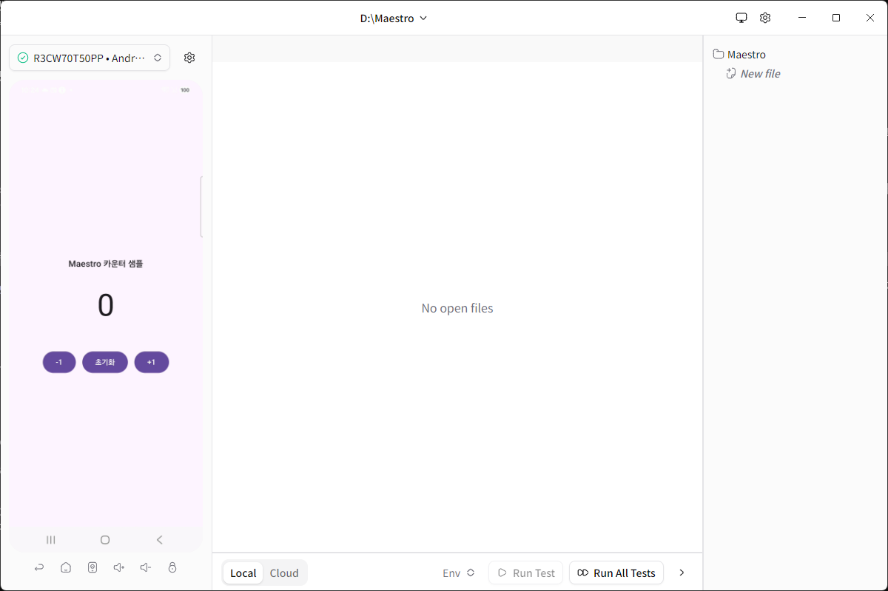
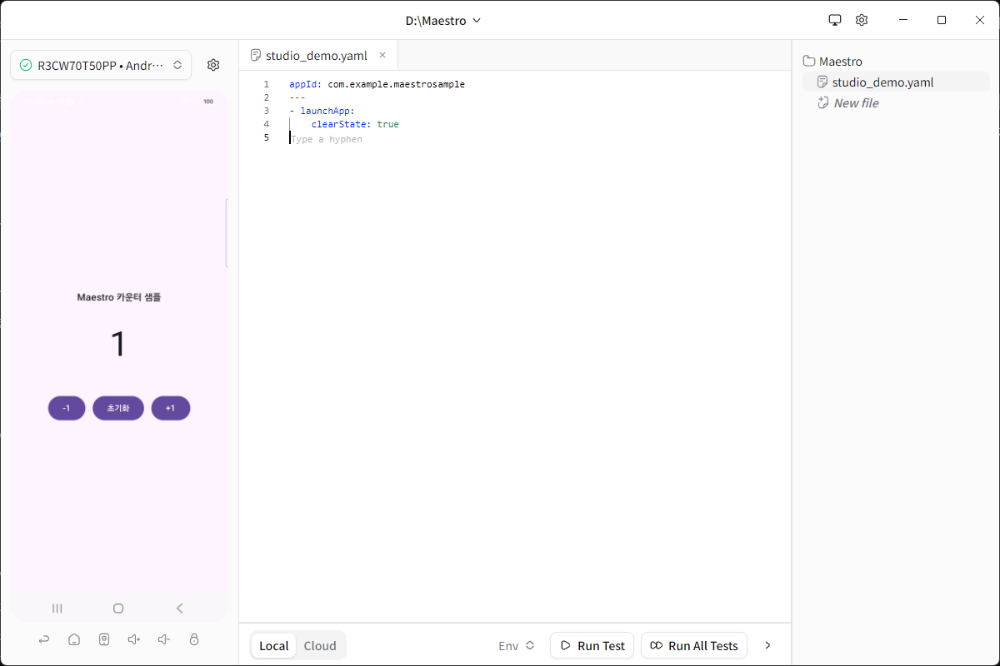
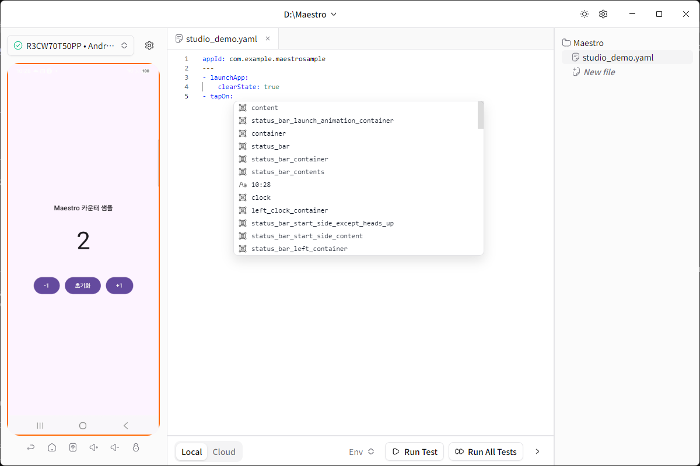
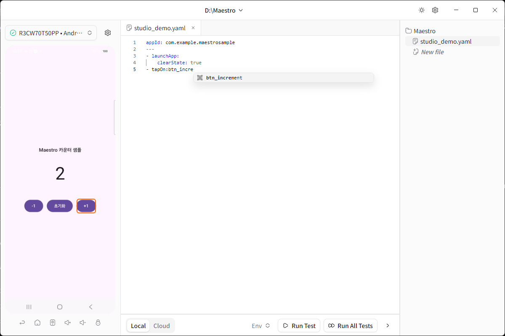
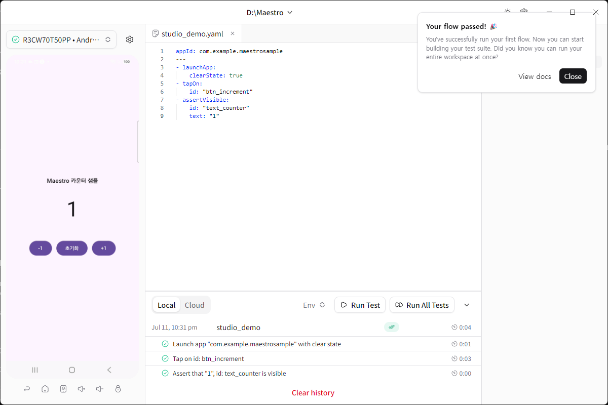

# AI와 Maestro로 안드로이드 앱 자동화 테스트하기 (2) — Maestro Studio로 화면 보면서 테스트 만들기

[1편](stage1-blog-post.md)에서는 AI에게 화면 구성을 설명하고 Maestro YAML 스크립트를 받아서, 스크립트 하나로 빌드부터 리포트까지 자동화하는 과정을 봤습니다. YAML 몇 줄이면 충분했지만, 그래도 "요소 id를 정확히 알아야 한다"는 부담은 남아있었습니다. 이번 편에서는 그 부담마저 없애주는 **Maestro Studio**를 써보겠습니다. 화면을 보면서 요소를 확인하고, 자동완성만으로 테스트를 조립하는 방법입니다.

## 1. Maestro Studio, 이제는 별도 데스크톱 앱

예전에는 `maestro studio`라는 CLI 명령 하나로 브라우저 기반 Studio가 떴습니다. 그런데 최신 Maestro CLI(2.6.1)에서 이 명령을 실행하면 이렇게 안내가 나옵니다.

```
Maestro Studio is no longer bundled with the CLI.
Download the new Maestro Studio desktop app instead:

  https://studio.maestro.dev/MaestroStudio.exe
```

Maestro Studio가 CLI에서 분리되어 **독립 데스크톱 앱**이 되었습니다. `studio.maestro.dev`에서 설치 파일을 받아 설치하면 됩니다. (새 프로그램을 설치하는 작업이니, 사내 PC나 회사 정책이 있는 환경이라면 설치 전에 한 번 확인하는 게 좋습니다.)

## 2. 앱을 열면 단말이 자동으로 연결된다

Maestro Studio를 실행하면 프로젝트 폴더를 하나 지정하게 되고, 그 안에서 테스트 파일들을 관리합니다. USB로 연결된 단말이 있으면 별도 설정 없이 바로 잡힙니다.


*단말(R3CW70T50PP)이 자동으로 인식되고, 1편에서 만든 카운터 앱 화면이 실시간으로 미러링된다*

왼쪽에는 단말 화면이 실시간으로 그대로 보이고, 오른쪽에는 프로젝트의 파일 목록이 있습니다. `New file`을 누르면 이름과 앱 ID를 입력하는 간단한 폼이 뜨고, 템플릿이 담긴 YAML 파일이 바로 만들어집니다.


*파일을 만들면 `launchApp` 템플릿이 채워진 채로 에디터가 열리고, 다음 줄을 어떻게 쓰면 될지 자동완성 힌트("Type a hyphen")까지 보여준다*

## 3. 이 부분이 핵심 — 화면의 요소를 그대로 자동완성으로 보여준다

1편에서는 Compose 코드에 있는 `testTag`를 보고 `id: "btn_increment"` 같은 값을 사람이 직접 알아내거나 AI에게 물어봐야 했습니다. Studio에서는 그럴 필요가 없습니다. YAML에 `tapOn:` 이라고 쓰고 다음 줄을 시작하면, **지금 단말 화면에 떠 있는 모든 요소의 id 목록**이 그대로 자동완성으로 뜹니다.


*`tapOn:` 다음 줄에서 바로 뜨는 자동완성 — 상태바부터 시작해서 화면에 있는 모든 요소의 id가 나열된다*

여기서 `btn_incre`까지만 타이핑하면 후보가 하나로 좁혀지고, 심지어 **그 요소가 실제 화면 어디에 있는지 왼쪽 미러링 화면에 테두리로 바로 표시**됩니다.


*`btn_increment`로 좁혀지자 왼쪽 미러링 화면의 `+1` 버튼에 주황색 테두리가 뜬다 — 내가 선택하려는 요소가 맞는지 눈으로 바로 확인 가능*

같은 방식으로 `assertVisible` 다음에 `id:`를 쓰면 검증 대상 요소도 동일하게 자동완성 + 하이라이트가 됩니다. id를 외우거나 코드를 열어볼 필요 없이, 화면을 보면서 그대로 골라서 테스트를 조립하는 겁니다.

이렇게 완성한 플로우는 다음과 같습니다.

```yaml
appId: com.example.maestrosample
---
- launchApp:
    clearState: true
- tapOn:
    id: "btn_increment"
- assertVisible:
    id: "text_counter"
    text: "1"
```

1편에서 AI가 작성해준 YAML과 문법은 완전히 동일합니다. 다만 이번에는 id 값을 하나도 외우거나 검색하지 않고, 화면을 보면서 클릭하듯 골라서 채웠다는 점이 다릅니다.

## 4. 그 자리에서 바로 실행하고 결과 확인

YAML을 저장하고 `Run Test`를 누르면 같은 창 안에서 바로 실행되고, 스텝별로 실시간 진행 상황이 표시됩니다.


*"Your flow passed!" — 3개 스텝(앱 실행 → 탭 → 검증)이 모두 초록색으로 통과했다*

빌드하고 단말에 설치하고 CLI 명령을 치는 과정 없이, 앱을 켜놓은 상태에서 화면을 보며 스크립트를 쓰고 그 자리에서 바로 검증까지 끝냅니다.

> **트러블슈팅**: Studio 데스크톱 앱을 쓴 뒤 다시 1편의 `maestro test` 스크립트를 돌리면 `dev.mobile.maestro was not installed`라는 오류가 날 수 있습니다. CLI와 Studio가 단말에 서로 다른 버전의 드라이버 앱을 설치해서 생기는 충돌입니다. `maestro test .maestro/ --reinstall-driver ...` 처럼 `--reinstall-driver` 옵션을 한 번 붙여서 실행하면 드라이버가 다시 정리되면서 해결됩니다.

## 5. 1편(AI) vs 2편(Studio), 언제 뭘 쓸까

| | AI에게 작성 요청 (1편) | Maestro Studio (2편) |
|---|---|---|
| 적합한 상황 | 시나리오가 이미 머릿속에 있고, 한 번에 여러 개를 뽑고 싶을 때 | 화면을 보면서 "이 버튼 id가 뭐더라" 확인하며 하나씩 만들 때 |
| 요소 id | AI가 코드를 읽고 추측하거나, 사람이 코드에서 찾아 알려줘야 함 | 화면에 있는 값을 자동완성으로 바로 선택, 틀릴 일이 없음 |
| 여러 시나리오 한 번에 | 강함 (경계값, 예외 케이스 등 한 번에 여러 개 생성) | 하나씩 만들면서 확인하기 좋음 |
| 실행 확인 | 스크립트로 빌드→설치→테스트 일괄 실행 | 에디터 안에서 바로 Run Test로 즉시 확인 |

실전에서는 두 가지를 섞어 쓰는 게 가장 효율적입니다. AI에게 초안을 왕창 받아두고, Studio로 열어서 요소 id가 맞는지 눈으로 확인하며 다듬고, 그 자리에서 바로 실행해보는 식입니다. 만들어진 YAML은 결국 같은 포맷이라 저장소의 `.maestro/` 폴더에 그대로 함께 넣고 `maestro test .maestro/`로 한 번에 돌릴 수 있습니다. (이번에 만든 `05_studio_demo.yaml`도 실제로 저장소에 추가해서, 다른 4개 플로우와 함께 스크립트 한 번으로 5/5 통과하는 것까지 확인했습니다.)

## 6. 정리

- Maestro Studio는 이제 CLI가 아니라 별도 데스크톱 앱으로 설치합니다.
- 앱을 켜면 연결된 단말이 자동으로 잡히고 화면이 실시간으로 미러링됩니다.
- YAML을 쓰다가 `id:` 자리에서 자동완성을 부르면, 지금 화면에 있는 요소 목록이 그대로 뜨고 미러링 화면에 하이라이트까지 됩니다.
- 그 자리에서 `Run Test`로 바로 실행하고 결과를 확인할 수 있습니다.
- 결과물은 1편의 AI 작성 YAML과 완전히 같은 포맷이라, 같은 저장소·같은 실행 스크립트에 자연스럽게 합쳐집니다.

코드를 몰라도, 요소 id를 외우지 않아도 테스트 자동화를 시작할 수 있다는 것을 확인했습니다. 다음에는 이 둘을 함께 쓰는 실전 워크플로우(AI로 초안 뽑고 Studio로 다듬기)를 더 큰 화면 구성으로 다뤄보겠습니다.

---

**태그**: Android, Maestro, MaestroStudio, 안드로이드, UI자동화테스트, 모바일테스트자동화, Kotlin, JetpackCompose, 테스트자동화, QA, 노코드테스트
