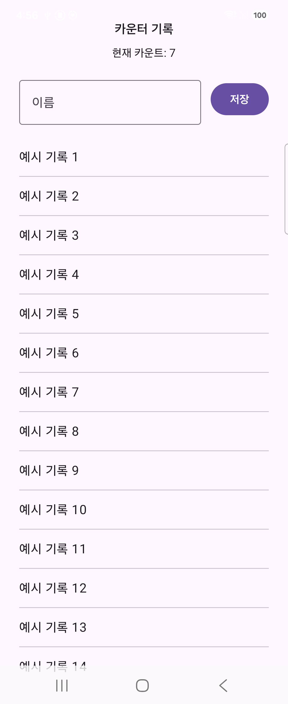
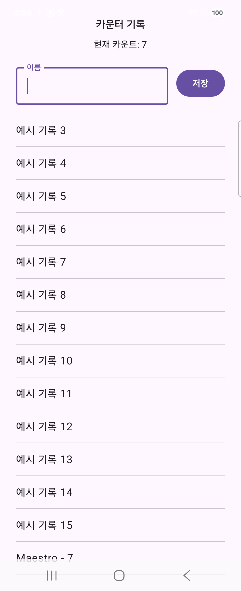

# AI와 Maestro로 안드로이드 앱 자동화 테스트하기 (4) — 화면이 늘어나면 테스트는 어떻게 달라지나

[1편](stage1-blog-post.md)에서 AI가 짠 스크립트로 테스트를 자동화했고, [2편](stage2-blog-post.md)에서 Maestro Studio로 화면을 보면서 테스트를 만들었고, [3편](stage3-blog-post.md)에서 커밋마다 CI가 알아서 돌려주는 것까지 만들었습니다. 그런데 지금까지의 테스트 대상은 **화면이 하나뿐인** 카운터 앱이었습니다. 실제 앱은 그렇지 않죠. 화면을 이동하고, 텍스트를 입력하고, 목록을 스크롤하고, 서버 응답을 기다립니다. 이번 편에서는 앱에 화면을 하나 추가하면서, 실전 앱을 테스트할 때 반드시 마주치는 네 가지 문제(화면 전환·입력·스크롤·비동기 로딩)를 Maestro로 어떻게 푸는지 다룹니다.

## 1. 앱에 '기록 화면'을 추가했다

카운터 앱에 두 번째 화면을 추가했습니다. 카운터 화면의 `기록` 버튼을 누르면 이동하는 **기록 화면**입니다.

- 진입하면 **2초간 로딩 스피너**가 돕니다 (실제 앱에서 서버/DB 조회가 걸리는 상황을 흉내)
- 로딩이 끝나면 **기록 목록**이 나타납니다 (스크롤 테스트가 가능하도록 예시 기록 15개를 미리 채움)
- 이름을 입력하고 `저장`을 누르면 `이름 - 현재카운트` 형식의 기록이 **목록 맨 끝에** 추가됩니다


*기존 카운터 화면 아래에 `기록` 버튼이 추가됐다 — 기존 테스트 5개는 전혀 수정하지 않았다*


*기록 화면 진입 직후 2초간 보이는 로딩 스피너 — 이것 때문에 테스트에 '대기'가 필요해진다*


*로딩이 끝나면 나타나는 입력창 + 예시 기록 목록*

화면 전환은 안드로이드 표준인 **Navigation Compose**를 사용했습니다.

```kotlin
NavHost(navController = navController, startDestination = "counter") {
    composable("counter") {
        CounterScreen(
            count = count,
            onCountChange = { count = it },
            onNavigateToHistory = { navController.navigate("history") },
        )
    }
    composable("history") {
        HistoryScreen(
            currentCount = count,
            records = records,
            onSave = { name -> records.add("$name - $count") },
        )
    }
}
```

## 2. 개발자 관점 — 테스트 가능한 앱은 개발 단계에서 만들어진다

화면을 추가하면서 겪은 일 두 가지가, 사실 이번 편에서 제일 하고 싶은 이야기입니다.

**첫째, testTag는 UI를 만들 때 같이 심는다.** 1편에서는 이미 만들어진 화면에 testTag를 나중에 붙였지만, 이번에는 기록 화면을 만들면서 처음부터 모든 상호작용 요소에 testTag를 달았습니다(`btn_history`, `input_name`, `btn_save`, `list_history`, `loading_indicator`). 이렇게 하면 화면이 완성되는 순간 테스트도 바로 짤 수 있습니다. 팀이라면 "머지 전에 새 UI 요소에는 testTag가 있어야 한다"를 코드리뷰 항목으로 넣을 만합니다.

```kotlin
OutlinedTextField(
    value = name,
    onValueChange = { name = it },
    label = { Text("이름") },
    singleLine = true,
    modifier = Modifier
        .weight(1f)
        .testTag("input_name"),   // 만들 때 바로 심는다
)
```

**둘째, 화면이 두 개가 되는 순간 상태 관리가 테스트를 좌우한다.** 카운트 상태를 원래처럼 `CounterScreen` 안에 `remember`로 두면, 기록 화면에 다녀오는 순간 카운트가 0으로 리셋됩니다. 화면이 백스택에서 벗어날 때 컴포저블이 파기되기 때문입니다. 그래서 카운트를 NavHost 위로 끌어올리고(`상태 호이스팅`) `rememberSaveable`로 바꿨습니다.

```kotlin
// remember만 쓰면 기록 화면으로 이동하는 순간 카운터 화면이
// 백스택에서 파기되면서 값이 사라진다.
var count by rememberSaveable { mutableIntStateOf(0) }
```

이건 테스트를 위한 코드가 아니라 그냥 올바른 앱 코드입니다. 그런데 이런 버그(화면 다녀오면 값이 사라짐)야말로 수동 테스트에서 놓치기 쉽고, 자동화 테스트가 잡아주는 대표적인 유형입니다. 아래 08번 플로우가 정확히 이 시나리오를 검증합니다.

## 3. 새로 필요해진 Maestro 커맨드들

새 플로우 3개에서 처음 등장하는 커맨드를 하나씩 보겠습니다.

### 텍스트 입력 — `inputText`와 `hideKeyboard`

```yaml
- tapOn:
    id: "input_name"
- inputText: "Maestro"

# 키보드가 목록 하단을 가리므로 내리고 나서 저장/스크롤한다
- hideKeyboard

- tapOn:
    id: "btn_save"
```

입력 필드를 먼저 탭해서 포커스를 주고 `inputText`로 입력합니다. 여기서 실전 팁 하나 — **입력하고 나면 키보드가 화면 절반을 가립니다.** 사람은 무의식적으로 키보드를 내리지만 테스트는 그렇지 않아서, 키보드 뒤에 숨은 요소를 찾다가 실패합니다. `hideKeyboard`를 습관처럼 넣어주는 게 좋습니다.

### 스크롤 — `scrollUntilVisible`

저장한 기록은 목록 맨 끝에 추가되므로 화면에 바로 보이지 않습니다. "보일 때까지 스크롤"이 필요합니다.

```yaml
# 새 기록은 목록 맨 끝에 추가되므로 스크롤해야 보인다
- scrollUntilVisible:
    element:
      text: "Maestro - 7"
    direction: DOWN
```

`assertVisible`은 지금 화면에 보이는 것만 찾지만, `scrollUntilVisible`은 찾을 때까지 스크롤을 반복하다가 끝까지 가도 없으면 실패합니다. 목록 화면 검증의 기본기입니다.

### 비동기 대기 — `extendedWaitUntil`

기록 화면은 진입 후 2초가 지나야 목록이 나타납니다. 이럴 때 제일 쉽게 떠오르는 방법은 "3초 기다려"(고정 sleep)지만, 이건 두 가지 문제가 있습니다. 로딩이 빨리 끝나도 무조건 3초를 낭비하고, 어쩌다 3초를 넘기면 테스트가 깨집니다(flaky). 대신 **조건이 충족될 때까지만** 기다리는 `extendedWaitUntil`을 씁니다.

```yaml
# 진입 직후에는 로딩 스피너가 보인다
- assertVisible:
    id: "loading_indicator"

# 로딩(2초)이 끝나면 목록이 나타난다 — 고정 sleep 대신 조건 대기
- extendedWaitUntil:
    visible:
      id: "list_history"
    timeout: 5000

- assertNotVisible:
    id: "loading_indicator"
```

timeout(5초)은 "최악의 경우 상한"일 뿐, 목록이 2초 만에 나타나면 즉시 다음 스텝으로 넘어갑니다.

### 뒤로가기 — `back`

```yaml
# 시스템 뒤로가기로 카운터 화면 복귀 (백스택 검증)
- back

- assertVisible:
    id: "text_counter"
```

시스템 뒤로가기 버튼을 누르는 커맨드입니다. 별것 아닌 것 같지만, "뒤로 갔을 때 앱이 종료되지 않고 이전 화면으로 돌아가는가"는 내비게이션을 새로 붙였을 때 가장 먼저 깨지는 부분입니다.

## 4. 플로우가 늘어나면 중복이 생긴다 — `runFlow`로 공통화

플로우가 8개가 되니 모든 플로우의 첫 부분("앱 데이터 지우고 새로 실행")이 똑같이 반복됩니다. 이런 공통 부분은 서브플로우로 빼고 `runFlow`로 불러 쓸 수 있습니다.

```yaml
# .maestro/common/launch_clean.yaml
appId: com.example.maestrosample
name: 공통 — 앱 데이터를 초기화하고 새로 실행 (runFlow 서브플로우)
---
- launchApp:
    stopApp: true
    clearState: true
```

```yaml
# 각 플로우에서는 한 줄로 재사용
- runFlow: common/launch_clean.yaml
```

여기서 폴더 이름이 중요합니다. `maestro test .maestro/`처럼 폴더째 실행하면 Maestro는 **하위 폴더로 내려가지 않기** 때문에, `common/` 안의 서브플로우는 단독 테스트로 실행되지 않고 `runFlow`를 통해서만 불립니다. 서브플로우를 테스트 플로우와 같은 폴더에 두면 혼자서도 실행돼 버리니, 하위 폴더로 분리하는 게 관례입니다.

## 5. 로컬 실행 — 그런데 첫 실행에서 또 당했다

1편에서 만든 `run-tests.ps1`을 그대로 실행했는데, 기존 5개 플로우가 통과한 직후 러너가 통째로 죽었습니다.

```
java.io.FileNotFoundException: ...\reports\debug\...\commands-(기록 저장 — 카운트 7에서
이름을 입력해 저장하면 목록 끝에 "Maestro - 7"이 남는다).json
(파일 이름, 디렉터리 이름 또는 볼륨 레이블 구문이 잘못되었습니다)
```

원인은 플로우의 `name:`에 넣은 **큰따옴표**였습니다. Maestro는 `--debug-output`으로 디버그 파일을 저장할 때 플로우 이름을 파일명에 그대로 사용하는데, Windows에서는 `"`가 파일명 금지 문자입니다. 그래서 새 플로우는 실행도 못 해보고 그 앞에서 전체 실행이 중단된 겁니다. 플로우 이름에서 따옴표를 빼는 것으로 해결했습니다.

> 1편의 한글 인코딩(cp949), 3편의 실행 권한 비트에 이어, 이번에도 Windows에서만 터지는 함정이었습니다. 시리즈 내내 확인하게 되는 교훈: **플랫폼 경계(Windows↔리눅스, 로컬↔CI)를 넘는 지점에 함정이 산다.**

이름을 고치고 다시 실행하면 8개 플로우가 전부 통과합니다.

```
Waiting for flows to complete...
[Passed] 증가 — +1 버튼을 3번 누르면 3이 표시된다 (10s)
[Passed] 경계값 — 0에서 -1을 눌러도 음수로 내려가지 않는다 (6s)
[Passed] 초기화 — +1을 5번 누른 뒤 초기화하면 0으로 돌아간다 (17s)
[Passed] 달성 메시지 — 10에 도달하면 축하 메시지가 뜨고, 초기화하면 사라진다 (25s)
[Passed] Studio 데모 — Maestro Studio에서 클릭/자동완성만으로 조립한 플로우 (4s)
[Passed] 기록 저장 — 카운트 7에서 이름을 입력해 저장하면 목록 끝에 Maestro - 7이 남는다 (30s)
[Passed] 목록 스크롤 — 화면 밖에 있는 마지막 예시 기록까지 스크롤해서 찾는다 (8s)
[Passed] 비동기 로딩 — 스피너가 사라질 때까지 기다렸다가 목록을 확인하고 뒤로 돌아온다 (8s)

8/8 Flows Passed in 1m 48s
```

기존 5개는 한 글자도 고치지 않았는데 그대로 통과합니다. 카운터 화면에 버튼이 하나 늘었지만, 테스트가 전부 `id:` 셀렉터 기반이라 화면 구조가 조금 바뀌어도 영향을 받지 않은 겁니다. 텍스트나 좌표 대신 id로 요소를 찾는 게 왜 중요한지 보여주는 장면입니다.


*이름을 입력해 저장한 `Maestro - 7` 기록이 목록 끝에 남아 있다*

## 6. CI는 손도 대지 않았다

이번 편에서 제일 기분 좋은 부분입니다. 3편에서 만든 GitHub Actions 워크플로우는 `.maestro/` **폴더째** 실행하도록 되어 있어서, 플로우가 5개에서 8개로 늘어났지만 워크플로우 YAML은 한 글자도 고치지 않았습니다. 이번 커밋을 푸시하자 CI가 알아서 에뮬레이터를 띄우고 **6분 12초 만에 8개 플로우를 전부 통과**시켰습니다. 실행 결과는 공개 저장소에서 직접 볼 수 있습니다: [Actions 실행](https://github.com/JsonCorp/android-autotest-maestro-sample/actions/runs/29188019490)

인프라를 한 번 제대로 만들어두면, 그다음부터는 테스트만 추가하면 된다는 것 — 이게 3편에서 CI를 만들어둔 진짜 보상입니다.

## 7. 정리

| 실전 상황 | Maestro 커맨드 | 플로우 |
|---|---|---|
| 화면 이동 | `tapOn` + 목적지 요소 검증 | 06, 07, 08 |
| 텍스트 입력 | `inputText`, `hideKeyboard` | 06 |
| 스크롤 목록 | `scrollUntilVisible` | 06, 07 |
| 비동기 로딩 | `extendedWaitUntil` (고정 sleep 금지) | 06, 07, 08 |
| 뒤로가기/백스택 | `back` | 08 |
| 공통 부분 재사용 | `runFlow` + `common/` 하위 폴더 | 전체 |

그리고 코드 쪽 교훈 두 가지:

1. **testTag는 UI를 만들 때 같이 심는다.** 나중에 붙이려면 코드를 다시 뒤져야 하지만, 만들 때 심으면 공짜다.
2. **화면이 늘어나는 순간 상태 호이스팅이 테스트 가능성을 좌우한다.** `rememberSaveable`로 올바르게 관리된 상태는 테스트로 검증할 수 있는 상태다.

1편(AI가 스크립트 작성) → 2편(Studio로 시각적으로) → 3편(CI로 자동 실행) → 4편(실전 앱 확장)까지, 화면 하나짜리 장난감 앱에서 시작해 실제 앱 테스트에 필요한 기법까지 왔습니다. 이 시리즈의 저장소는 공개되어 있으니, 직접 클론해서 돌려보시기 바랍니다.

---

**태그**: Android, Maestro, 안드로이드, UI자동화테스트, 모바일테스트자동화, JetpackCompose, NavigationCompose, Kotlin, 테스트자동화, QA, scrollUntilVisible, extendedWaitUntil
